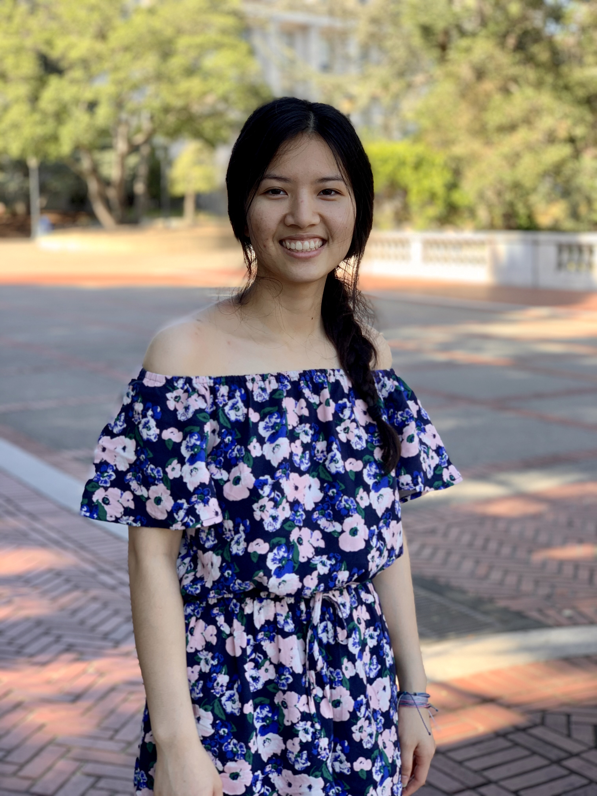

# Haley Kim Tran

## MINI-BIO

My name is Phuoc Kim Tran, but I go by Haley. My pronouns are she, her, and hers. I am a 4th year undergraduate student at UC San Diego. I am in Warren College, majoring in Mathematics-Computer Science. I love learning new [languages]() and engaging with new cultures through exploring their music and movies. I am interested in learning more about web development, AI, and machine learning. 

In the words of [Brian Herbert](https://www.pinterest.com/pin/160440805452520296/):
> The capacity to learn is a ***gift***; the ability to learn is a ***skill***; the willingness to learn is a ***choice***.

## Contact

Email: pkt006@ucsd.edu

## Languages
###### in the order of proficiency

1. English
2. Vietnamese
3. Mandarin
4. Thai

## Courses Taken

[x] CSE 100
[x] CSE 130
[ ] CSE 141
